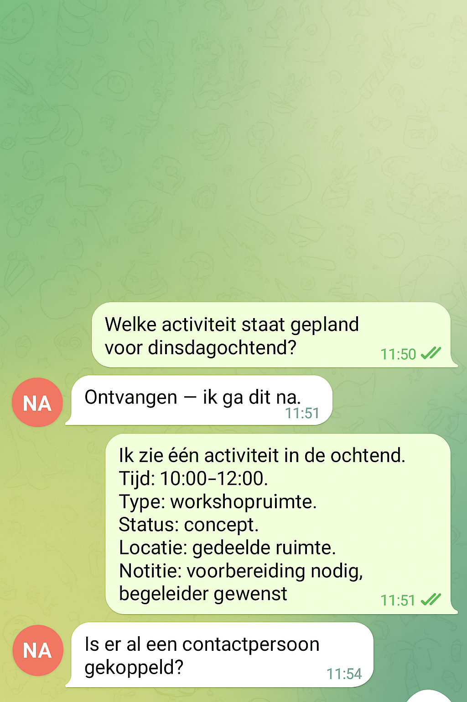

# Synthetic bot chat visual

This visual shows the chat-shaped interaction surface of the assistant in a synthetic form.

It keeps the real workflow pattern:
- a practical user question
- a short acknowledgement
- a structured operational reply
- a bounded follow-up answer

It does not reproduce real bookings, names, locations, or internal records.

## Why this is synthetic
The public repo should show how the assistant interaction works without exposing operational details from the live context.

This image is therefore a reconstructed demo screenshot based on the real interaction shape, not a direct production screenshot.

## What it shows
- a Telegram-like group chat interface
- a practical planning question in Dutch
- a bot response that returns structured operational information
- a follow-up question about whether a contact field is filled in

## What it avoids
- real dates tied to real operations
- real room names or internal labels
- customer or contact details
- raw internal scheduling notes
